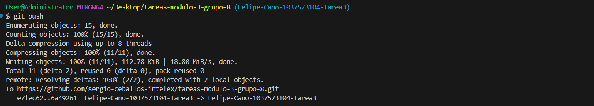

### Tutorial: Inicialización, Agregado y Subida de Archivos a GitHub con Git

En este tutorial vamos a ver una guia practica de como trabajar con Github. 

El Git es un software de desarrollo que nos permite trabajar y controlar el manejo  de versiones. Trabajar proyectos mediante repositorios, clonarlos para tenerlo de manera local, hacerle seguimiento a los cambios que se hacen de manera local y así mismo gestionar y enviar cambios al repositorio remoto. 
Tambien se podria generar ramas para tener distintas versiones de un mismo código, y luego fusionar esas misma ramas para implementar funcionalidades unas de otras.

**PASOS**

* **PASO 1:** Definir en que directorio o lugar se desea colocar el repositorio. Recomiendo colocar el repositorio por ejemplo en el Escritorio o carpeta conocida como Mis documentos.

    En este paso se debe abrir el terminal Git Bash en el visualcode y ahi ubicarnos en el directorio deseado. Debe usar los comandos conocidos como cd, ls entre otros.

    El terminal debe inicializar aca: User@Administrator MINGW64.

    Aca buscamos mediante cd/Desktop o cd C:\Users\User\Documents

    

* **PASO 2:** Clonamos el repositorio remoto en nuestro equipo. Para esto utilizamos el comando git clone url_repository 

    

* **PASO 3:** Una vez el visual realiza la descarga del repositorio en nuestro equipo procedemos a inicializar ese repositorio mediante el comando git init 

    

* **PASO 4:** En este paso podemos entonces agregar a la etapa "staging area" o etapa de preparacion de envio usando el comando git add_nombredelarchivo o add . si queremos preparar todos los cambios o archivos.

    

* **PASO 5:** Y luego usamos el comando git commit -m "alguna indicacion" para pasar esos cambios de preparacion a envio.

    

* **PASO 6:**  Una vez ya enviamos los archivos es importante declarar comunicacion entre el repositorio remoto y el local mediante el comando git remote add origin ...url...

    

* **PASO 7:** En este paso subimos esos cambios en el(los) archivo(s) mediante el comando git push -u origin nombre_de_rama. 

    

* **PASO 8:** Finalmente terminamos el proceso realizando el PR o pull request en Github mediante el icono que se encuentra en la plataforma y ahi el administrador nos permite subir los cambios al main y asi terminar el proceso.