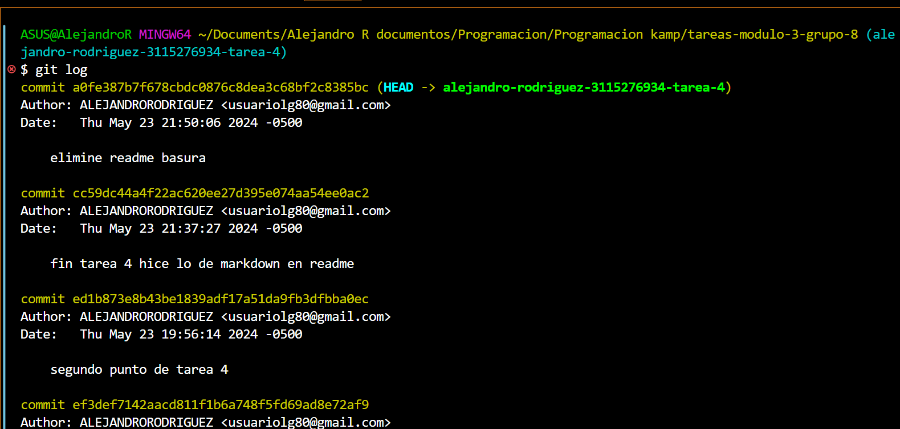

# tarea 4
----
#####  este algoritmo se hizo creando un bucle que se repite 50 veces y se va imprimiendo 1 a 1 cada iteracion, se creo una variable let numero que inicia en cero, y qye en cada iteracion va sumando de a 1 

##### Ahora se cambio el numero de iteraciones a 2000, con esto logramos que se impriman los numeros de 1 en 1 hasta 2000

##### Para la parte  3 de esta tarea se  uso la propiedad starysWith, para pasar los numeros a strings y con el if le decimos que solo nos imprima los numeros que comienza con '2'
_______
-------
* En Git lo primero fue pasarme a rama main y hacer pull para traer los cambios que hubieram hay
* luego cree mi nueva rama para la tarea 4 con las especificaciones solicitadas para su nombre.
* Despues se fue haciendo punto por punto de los requerimientos y guardando los cambios con git add. , git commit -. "msj" y git push origin nombre de la rama que acabe de crear.

### *- Se hizo Pull Requests, en  espera de ser **aprobados**.*-

* adiciono imagen pantallazo del codigo.

